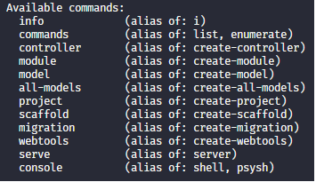
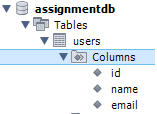

**Table of Contents**

- [Disclaimer](#disclaimer)
- [General Information](#general-information)
  - [What Is Phalcon](#what-is-phalcon)
  - [Phalcon Devtools](#phalcon-devtools)
- [Technical Information](#technical-information)
  - [Bootstrap](#bootstrap)
    - [Auto Loaders](#auto-loaders)
    - [Dependency Management](#dependency-management)
        - [Factory Default](#factory-default)
    - [The Application Request](#the-application-request)
    - [Phalcon and MVC](#phalcon-and-mvc)
      - [Controller](#controller)
      - [View](#view)
      - [Model](#model)
    - [Putting Everything Together](#putting-everything-together)
  - [Connecting To Database](#connecting-to-database)
  - [CRUD-ing The Database](#crud-ing-the-database)
- [Volt](#volt)
- [Resources](#resources)
  - [Looks like might be useful](#looks-like-might-be-useful)

## Disclaimer
These notes give a summary of useful information for roughly understanding what phalcon is and how it works. The more I understand as I go, the more I will be able to add to these notes.

## General Information
_What is Phalcon anyway?_
### What Is Phalcon

>Phalcon is an open source full stack framework for PHP, written as a C-extension. Phalcon is optimized for high performance. Its unique architecture allows the framework to always be memory resident, offering its functionality whenever its needed, without expensive file stats and file reads that traditional PHP frameworks employ.

Phalcon is a full stack PHP _"extension"_.

### Phalcon Devtools
>This tool provide you useful scripts to generate code helping to develop faster and easy applications that use with Phalcon framework.

Phalcon devtools improves the development experience by running an application without the need to configure a web server. This is done with the help of [.htrouter](https://github.com/phalcon/phalcon-devtools/blob/master/templates/.htrouter.php)

___
>NOTE: Phalcon development tools commands:

___
## Technical Information
_How does Phalcon work?_
### Bootstrap
>NOTE: Need to read up more on this

I assume this is index.php in the public directory

>This file is the entry point and configuration of the application, here, you can implement initialization of components as well as application behavior. This file handles three things:
>1. Registration of component autoloaders
>2. Configuring Services and registering them with the Dependency Injection context
>3. Resolving the application’s HTTP requests

#### Auto Loaders
>Autoloaders leverage a PSR-4 compliant file loader running through the Phalcon. Common things that should be added to the autoloader are your controllers and models. You can register directories which will search for files within the application’s namespace. If you want to read about other ways that you can use autoloaders head here.

#### Dependency Management
>Since Phalcon is loosely coupled, services are registered with the frameworks Dependency Manager so they can be injected automatically to components and services wrapped in the IoC container. Frequently you will encounter the term DI which stands for Dependency Injection. Dependency Injection and Inversion of Control(IoC) may sound like a complex feature but in Phalcon their use is very simple and practical. Phalcon’s IoC container consists of the following concepts:
>* Service Container: a “bag” where we globally store the services that our application needs to function.
>* Service or Component: Data processing object which will be injected into components

###### Factory Default
>The Phalcon\Di\FactoryDefault is a variant of Phalcon\Di. To make things easier, it will automatically register most of the components that come with Phalcon. We recommend that you register your services manually but this has been included to help lower the barrier of entry when getting used to Dependency Management. Later, you can always specify once you become more comfortable with the concept.

#### The Application Request
>Its purpose is to initialize the request environment, route the incoming request, and then dispatch any discovered actions; it aggregates any responses and returns them when the process is complete.

_public/index.php_

```
<?php

use Phalcon\Mvc\Application;

// ...

$application = new Application($di);
$response = $application->handle();
$response->send();
```

#### Phalcon and MVC
Phalcon uses a MVC pattern.

##### Controller
>By default Phalcon will look for a controller named IndexController. It is the starting point when no controller or action has been added in the request (eg. http://localhost:8000/). An IndexController and its IndexAction should resemble the following example:

_app/controllers/IndexController.php_
```
<?php

use Phalcon\Mvc\Controller;

class IndexController extends Controller
{
    public function indexAction()
    {
        echo '<h1>Hello!</h1>';
    }
}
```
___
>IMPORTANT: The controller classes must have the suffix Controller and controller actions must have the suffix Action. Going to eg. http://localhost:8000/register without having a register controller will throw an error.
___

##### View
>Sending output to the screen from the controller is at times necessary but not desirable as most purists in the MVC community will attest. Everything must be passed to the view that is responsible for outputting data on screen. Phalcon will look for a view with the same name as the last executed action inside a directory named as the last executed controller.

Following the controller example above we can create an index view:

_app/views/index/index.php_

```
<?php

echo "<h1>Hello!</h1>";

echo PHP_EOL;

echo PHP_EOL;

echo $this->tag->linkTo(
    'signup',
    'Sign Up Here!'
);
```
___
>NOTE: I have no idea yet what the purpose of **echo PHP_EOL** is.
___
##### Model
>Phalcon brings the first Object Relationship Mapping for PHP entirely written in C-language. Instead of increasing the complexity of development, it simplifies it.

The models in your application maps to the entities / domains in your database.

In my case:

_app/models/users.php_
```
<?php

use Phalcon\Mvc\Model;

class Users extends Model
{
    public $id;
    public $name;
    public $email;
}
```
Refers to the users table in my MySQL database.
 

#### Putting Everything Together
The index file should look like this after bootstrapping:

_app/public/index.php_

```
<?php

use Phalcon\Loader;
use Phalcon\Mvc\View;
use Phalcon\Mvc\Application;
use Phalcon\Di\FactoryDefault;
use Phalcon\Mvc\Url as UrlProvider;

// Define some absolute path constants to aid in locating resources
define('BASE_PATH', dirname(__DIR__));
define('APP_PATH', BASE_PATH . '/app');

// Register an autoloader
$loader = new Loader();

$loader->registerDirs(
    [
        APP_PATH . '/controllers/',
        APP_PATH . '/models/',
    ]
);

$loader->register();

// Create a DI
$di = new FactoryDefault();

// Setup the view component
$di->set(
    'view',
    function () {
        $view = new View();
        $view->setViewsDir(APP_PATH . '/views/');
        return $view;
    }
);

// Setup a base URI
$di->set(
    'url',
    function () {
        $url = new UrlProvider();
        $url->setBaseUri('/');
        return $url;
    }
);

$application = new Application($di);

try {
    // Handle the request
    $response = $application->handle();

    $response->send();
} catch (\Exception $e) {
    echo 'Exception: ', $e->getMessage();
}
```
### Connecting To Database
>In order to use a database connection and subsequently access data through our models, we need to specify it in our bootstrap process. A database connection is just another service that our application has that can be used for several components:

Since I will be using MySQL my connection set up looks like this:

_public/index.php_

```
<?php

use Phalcon\Db\Adapter\Pdo\Mysql as DbAdapter;

// Setup the database service
$di->set(
    'db',
    function () {
        return new DbAdapter(
            [
                'host'     => '127.0.0.1',
                'username' => <your_db_username>,
                'password' => <your_db_password>,
                'dbname'   => <your_db_name>,
            ]
        );
    }
);
```
___
>NOTE: Support for database engines and other database configurations can be found [here](https://docs.phalcon.io/3.4/en/db-layer).
___

### CRUD-ing The Database
To do a simple create and read,  the following user model will be used:
```
<?php

use Phalcon\Mvc\Model;

class Users extends Model
{
    public $id;
    public $name;
    public $email;
}
```
>The class’s public properties map to the fields of the users table in our database.

In our case our user table DDL:

```
CREATE TABLE `users` (
	`id` 		int(10) unsigned    NOT NULL AUTO_INCREMENT,
	`name`	    varchar(70) 	    NOT NULL,
	`email`		varchar(70)	        NOT NULL,

	PRIMARY KEY (`id`)
)
```
and then:

_instantiate_

` $user = new Users();`

The Phalcon model method _save()_ can now be called on our user instance.

>An array could be passed to save to avoid assign every column manually.

Example based on our database table:

```
...
 $user = new Users();
 $user->save([
        'name' => 'Omar',
        'email' => 'example@email.con'
    ])
 ...
```

More on creating records using Phalcon models [here](https://docs.phalcon.io/3.4/en/db-models#creatingupdating-records)

To retrieve users in the database we can simply run one of the following, depending on needs:

```
// How many users are there?
$users = Users::find();
echo 'There are ', count($users), "\n";

// Get and print users ordered by name
$users = Users::find(
    [
        'order' => 'name',
    ]
);
foreach ($users as $user) {
    echo $user->name, "\n";
}

// Get first 100 users ordered by name
$users = Users::find(
    [
        'order' => 'name',
        'limit' => 100,
    ]
);
foreach ($users as $user) {
   echo $user->name, "\n";
}
```

More on finding records using Phalcon models [here](https://docs.phalcon.io/3.4/en/db-models#finding-records)

## Volt
>Volt views are compiled to pure PHP code, so basically they save the effort of writing PHP code manually

## Resources
1. [Phalcon](https://docs.phalcon.io/3.4/en/introduction)
2. [DevTools](https://github.com/phalcon/phalcon-devtools)
3. [Discord](https://discordapp.com/invite/kRc2N2M)
4. [Forum](https://forum.phalcon.io/)

### Looks like might be useful
* [w3cub](https://docs.w3cub.com/phalcon~3/)